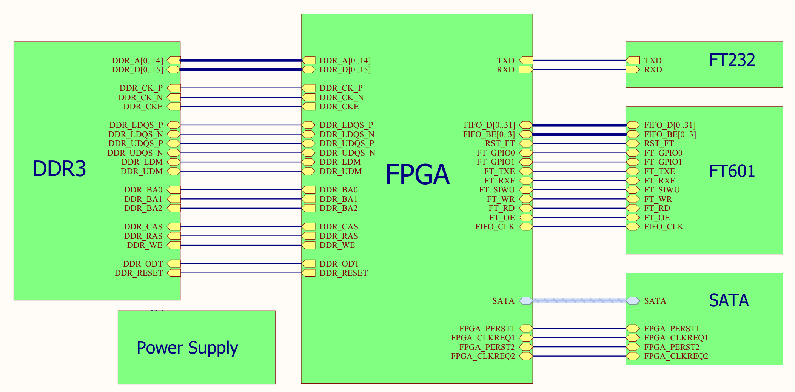

# PCIe Injector

### PCIe
PCIe is the main high speed way of communicating between a processor and its peripherials. Used in PC, but also encapsulated in Thunderbolt, and now even used in mobile phones.
Doing Security on a PCIe system is complex because not only it requires using > $50k tools, but it is complicated to find devices that let you control the packets

### Featuring:
* 1. XC7A50T Xilinx Serie 7 FPGA
* 2. FT601 FTDI USB 3.0 
* 3. MT41K256 4Gb DDR3 DRAM
* 4. 4 High speed lane for up to PCIe 4x emulation

### History
Currently, there were only few attacks made on PCIe devices, and they were mostly done using a microblaze insinde a xilinx FPGA in which the TLP were sent/received. Making it hard to really analyze.
The other way was using one of those usb3380 which don't offer a lot of flexibility (32bit only) and no debug at all when it's about the PCIe state machine

## Principle

The PCIe injector is based on a Series 7 Xilinx FPGA that is connected to some RAM and a high speed USB 3.0 FT601  chip from FTDI.
It let us

* 1. Configure fully the PCIe core, and have the Constrol and Status register fully acccessible
* 2. Send/Receive TLPs over PCIe throught the USB 3.0
* 3. Have the packets sent over UDP in order to ease the creation of wireshark dissectors
* 4. Python (scapy?) based communication tool

The board connect to daughter boards over SATA cable. In fact, Signal Integrity is a key when doing PCIe. SATA cable are the cheapest way to keep the signal integrity in this case.

![Daughter Board(doc/SATA2PCIe.png)
